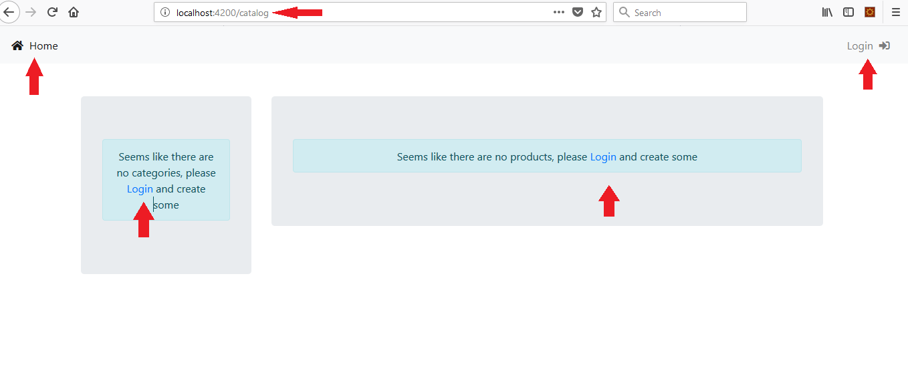
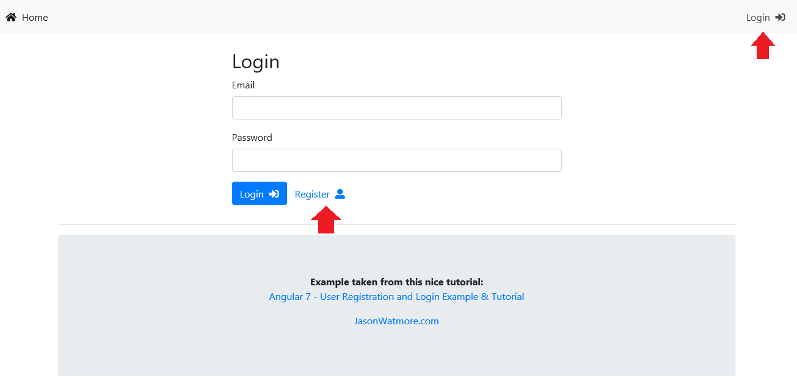
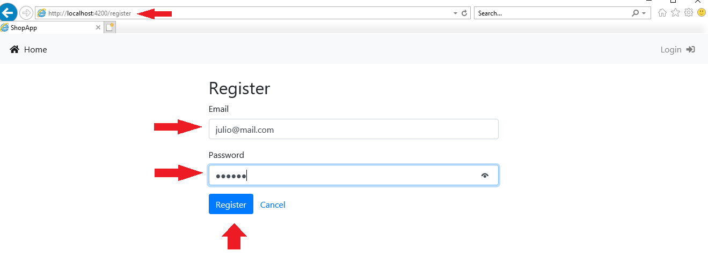
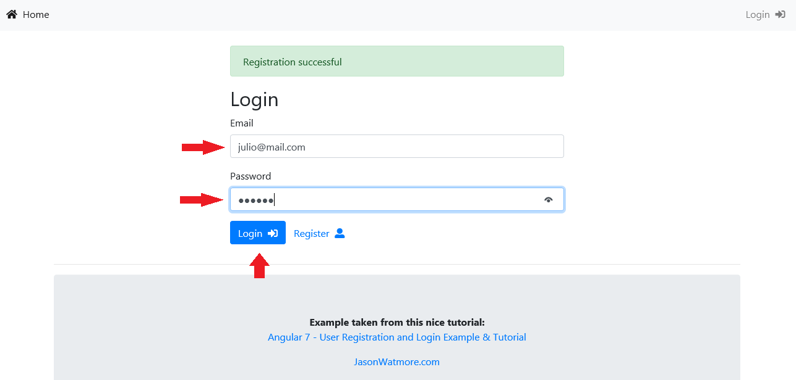
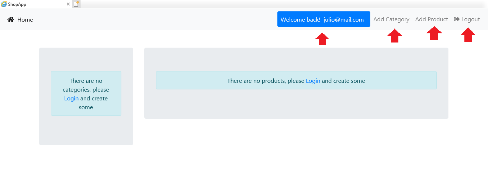
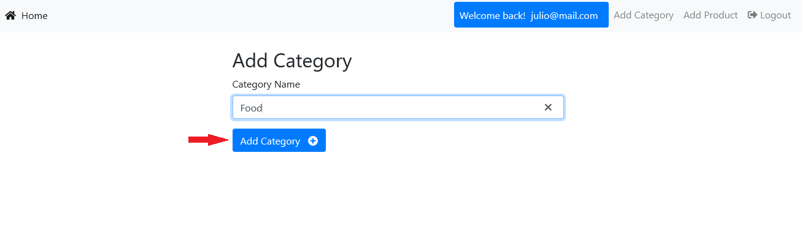
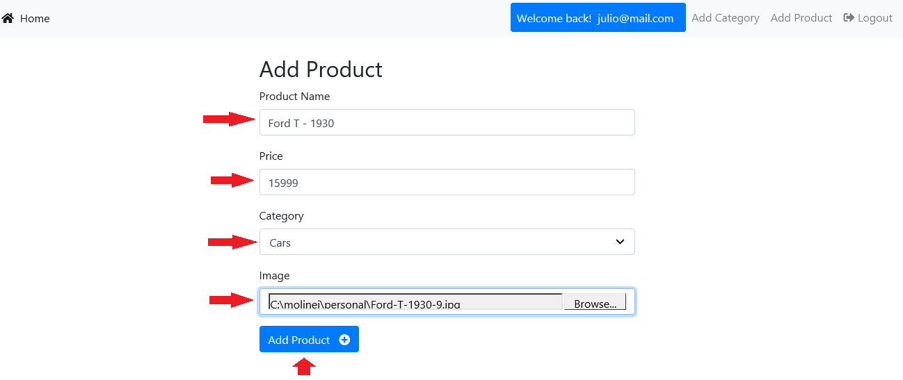
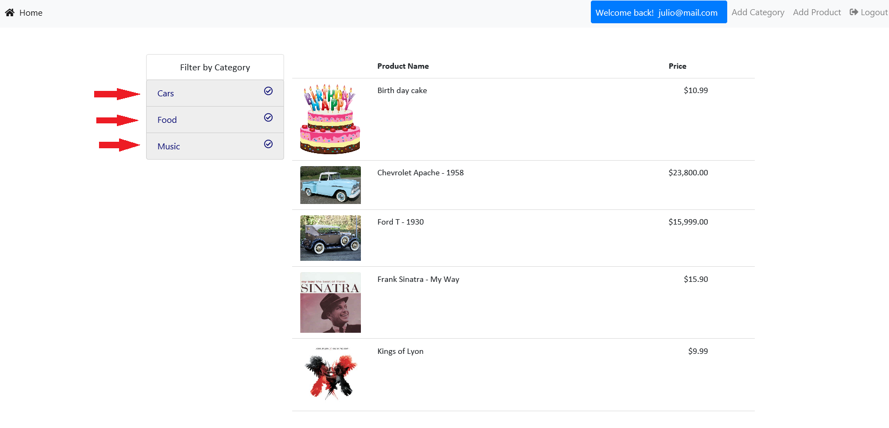

# A fully microservices-based MEAN application
This application shows how to consume NodeJS microservices hosted in different locations and/or databases. The system performs actions like:

- [x] User Creation 
- [x] Password Encryption
- [x] User Validation
- [x] JSON Web Token creation to be able to consume services that require authentication (this token expires in one hour)
- [x] Category creation (using JWT)
- [x] Product creation (using JWT)
- [x] Products listing 
- [x] Categories listing 
- [x] Filtering 

## Some of the tools/components I used on this project

- [x] Microsoft Visual Studio 2017
- [x] Powershell
- [x] MongoDB
- [x] Angular 7 with Webpack for the client
- [x] NodeJS with Express for all of the microservices
- [x] Bootstrap 4
- [x] Font-Awesome

### Installation
Make sure to clone or download ALL of these projects:

- [x] [Shop Client Angular](https://github.com/juliomolinero/shop-client-angular.git)
- [x] [Shop Auth](https://github.com/juliomolinero/shop-auth.git)
- [x] [Shop Users](https://github.com/juliomolinero/shop-users.git)
- [x] [Shop Categories](https://github.com/juliomolinero/shop-categories.git)
- [x] [Shop Products](https://github.com/juliomolinero/shop-products.git)

## Starting services and client application

- [x] Start MongoDB

Using Powershell, type the following:
```
PS C:\molinej>mongod --dbpath=C:\molinej\Data\MongoDB --logpath=C:\molinej\Data\MongoDB\mongo.log
2018-11-27T09:01:57.882-0600 I CONTROL  [main] Automatically disabling TLS 1.0, to force-enable TLS 1.0 specify --sslDisabledProtocols 'none'
2018-11-27T09:01:57.885-0600 I CONTROL  [main] log file "C:\molinej\Data\MongoDB\mongo.log" exists; moved to "C:\molinej\Data\MongoDB\mongo.log.2018-11-27T15-01-57".
```

- [x] Start Auth service

Using Powershell, navigate to the folder where the service is located and start NodeJS by typing npm start command.
```
PS C:molinej> cd C:\molinej\web\Node\shop-auth\
PS C:\molinej\web\Node\shop-auth> npm start

> shop-auth@1.0.0 start C:\molinej\web\Node\shop-auth
> nodemon server.js

[nodemon] 1.18.5
[nodemon] to restart at any time, enter `rs`
[nodemon] watching: *.*
[nodemon] starting `node server.js`
Listening auth service on port:3000 <--- Notice the service runs on port 3000, http://localhost:3000/auth
Connected to auth-users database
```

- [x] Start Users service

Using Powershell, navigate to the folder where the service is located and start NodeJS by typing npm start command.
```
PS C:molinej> cd C:\molinej\web\Node\shop-users\
PS C:\molinej\web\Node\shop-users> npm start

> shop-users@1.0.0 start C:\molinej\web\Node\shop-users
> nodemon server.js

[nodemon] 1.18.5
[nodemon] to restart at any time, enter `rs`
[nodemon] watching: *.*
[nodemon] starting `node server.js`
Listening users service on port:3001 <--- Notice the service runs on port 3001, http://localhost:3001/users
Connected to users database
```

- [x] Start Products service

Using Powershell, navigate to the folder where the service is located and start NodeJS by typing npm start command.
```
PS C:molinej> cd C:\molinej\web\Node\shop-products\
PS C:\molinej\web\Node\shop-products> npm start

> shop-products@1.0.0 start C:\molinej\web\Node\shop-products
> nodemon server.js

[nodemon] 1.18.5
[nodemon] to restart at any time, enter `rs`
[nodemon] watching: *.*
[nodemon] starting `node server.js`
Listening products service on port:3002 <--- Notice the service runs on port 3002, http://localhost:3002/products
Connected to products database
```

- [x] Start Categories service

Using Powershell, navigate to the folder where the service is located and start NodeJS by typing npm start command.
```
PS C:molinej> cd C:\molinej\web\Node\shop-categories\
PS C:\molinej\web\Node\shop-categories> npm start

> shop-categories@1.0.0 start C:\molinej\web\Node\shop-categories
> nodemon server.js

[nodemon] 1.18.5
[nodemon] to restart at any time, enter `rs`
[nodemon] watching: *.*
[nodemon] starting `node server.js`
Listening categories service on port:3003 <--- Notice the service runs on port 3003, http://localhost:3003/categories
Connected to categories database
```

- [x] Start Client application

Using Powershell, navigate to the folder where the client application is located and start NodeJS by typing npm start command.
```
PS C:\molinej> cd C:\molinej\web\Node\shop-client-angular\
PS C:\molinej\web\Node\shop-client-angular> npm start

> angular-7-registration-login-example@1.0.0 start C:\molinej\web\Node\shop-client-angular
> webpack-dev-server --mode development

｢wds｣: Project is running at http://localhost:4200/
｢wds｣: webpack output is served from /
｢wds｣: 404s will fallback to /index.html
｢wdm｣: Hash: 89aec61e1774a29a3656
Version: webpack 4.23.1
Time: 22666ms
Built at: 2018-11-27 09:08:44
```

## Running the application

### Once everything is up and running you should be able to open a browser, type http://localhost:4200 and see something like:


### Let's create a username, click Login and then Register


### Type your email and a password


### It will redirect to Login page, type your email and password


### At Home page, you'll see a welcome message and some additional features in the main menu


### Add 3 Categories: Cars, Food and Music


### Add some Products


### Go to home page, select all categories listed on the left and all of the products will appear



## Acknowledgments

* [Academind](https://academind.com) The NodeJS part
* [Jason Watmore](http://jasonwatmore.com/) The Angular-7 part
